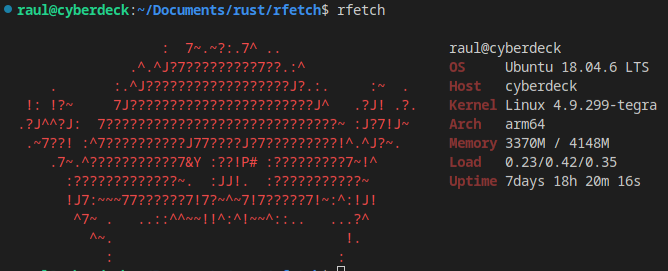
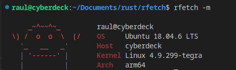

# rfetch
*A rust-y clone of pfetch*

This is a simple project I through together to be part of the Rewrite it in Rust (RIIR) club.

It displays some system information and a picture of Ferris, Rust's mascot. 

For now this application should only work in Linux, but I have compiled both for x64 and aarch64 systems. 

There are a few flags that can change the style of Ferris that is printed. 

